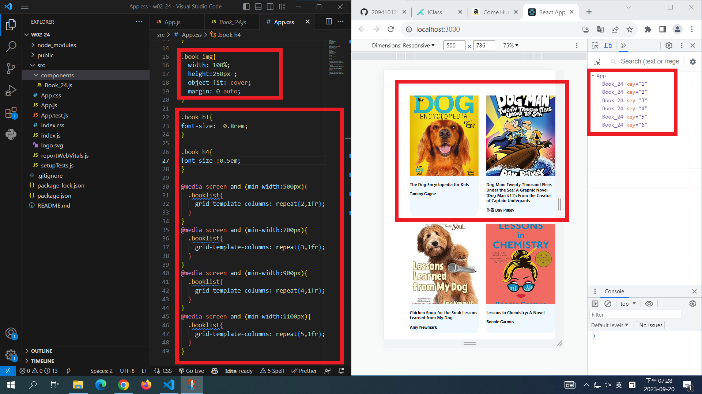
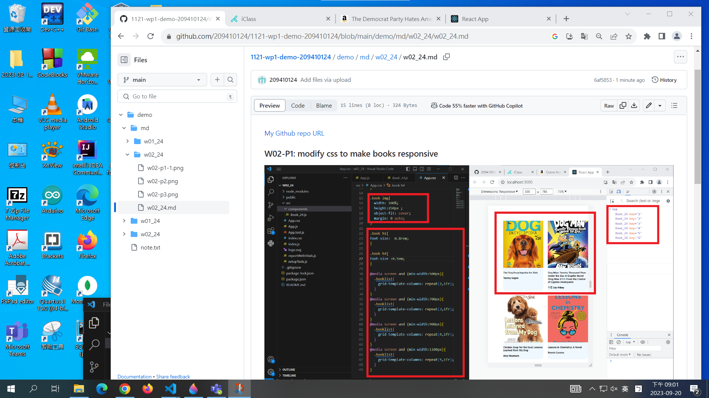
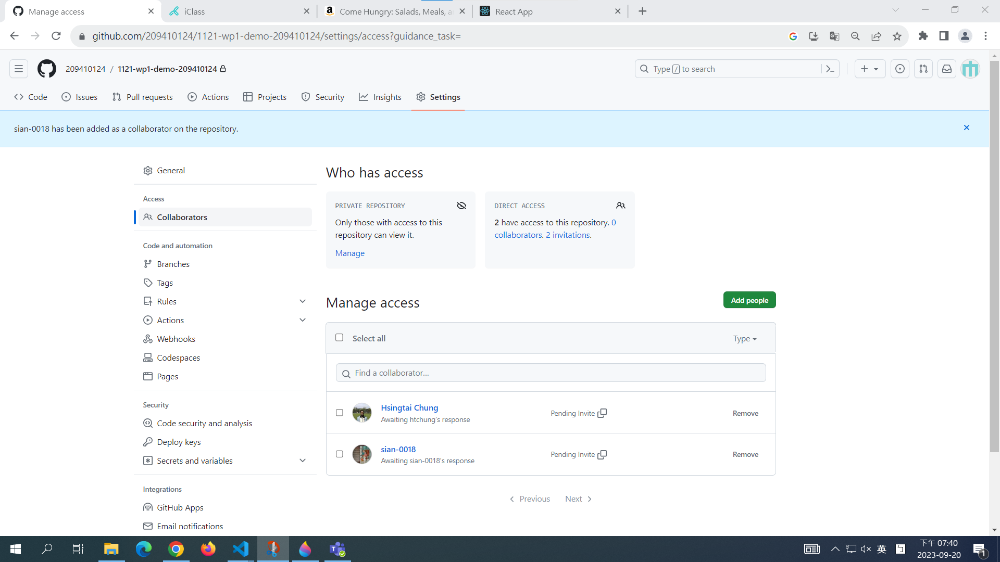
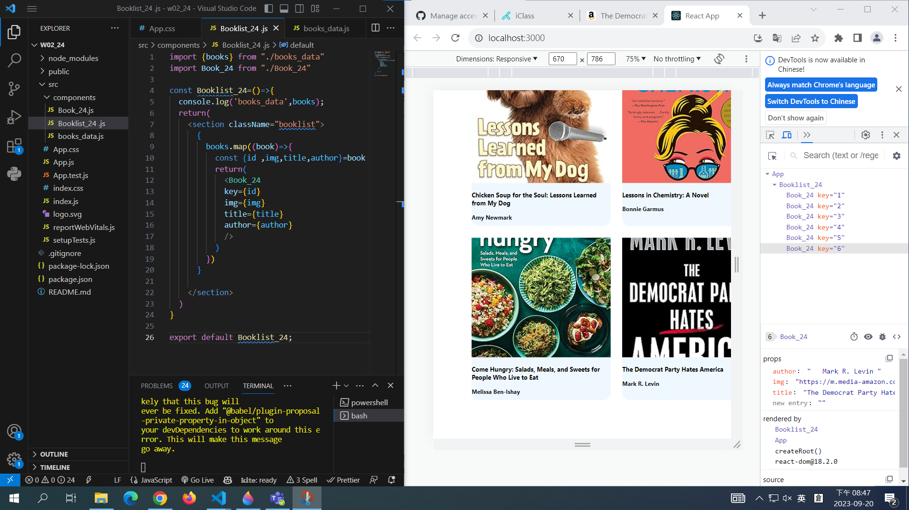
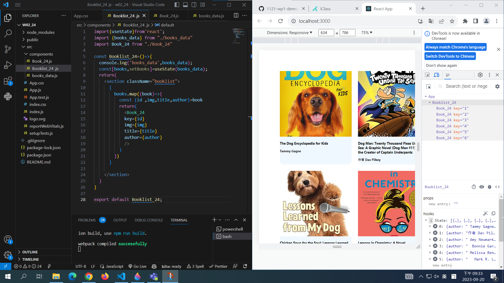

[My Github repo URL](https://github.com/209410124/1121-wp1-demo-209410124)

### W02-P1: modify css to make books responsive

###　 W02-P2: share Github repo to the teacher and TA

### W02-P3: Use <Booklist_24> to show all books in books_data.js array

### W02-P4: Use useState hook to store all books in books_data.js array

