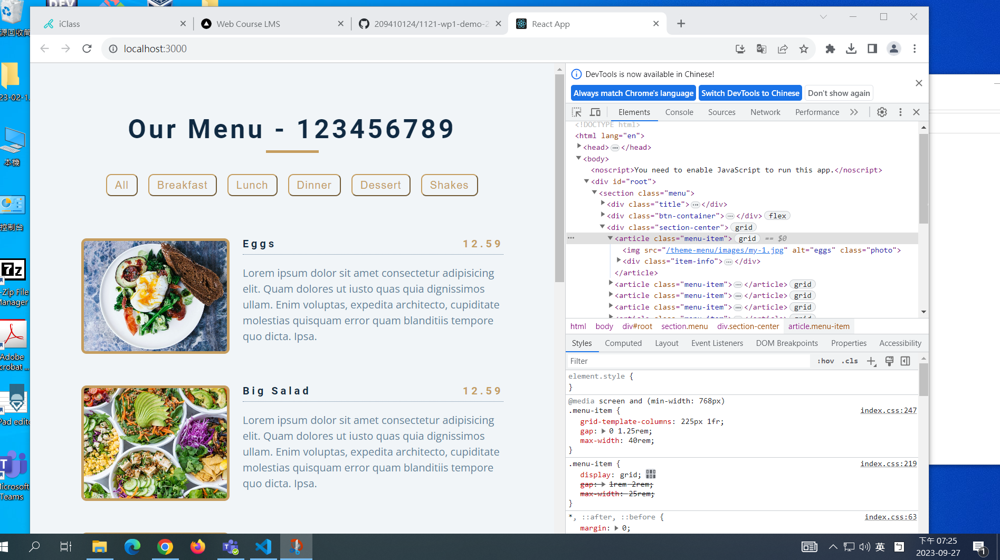

[My Github repo URL](https://github.com/209410124/1121-wp1-demo-209410124)

### W03-P1: Display all static menus in App.js




```
110a4f7 unknown Wed Sep 27 19:40:18 2023 +0800  W03-P1: Display all static menus in App.js~
```

### W03-P2: Display all menu from an array data.js


```
a54b0f1 unknown Wed Sep 27 20:18:25 2023 +0800  W03-P2: Display all menu from an array data.js
```

### W03-P3: Display all menu from <Menu_24>


```
cc12950 unknown Wed Sep 27 20:57:58 2023 +0800  W03-P3: Display all menu from <Menu_24>
```

### W03-P4: Display all category buttons from <Category_24 />


