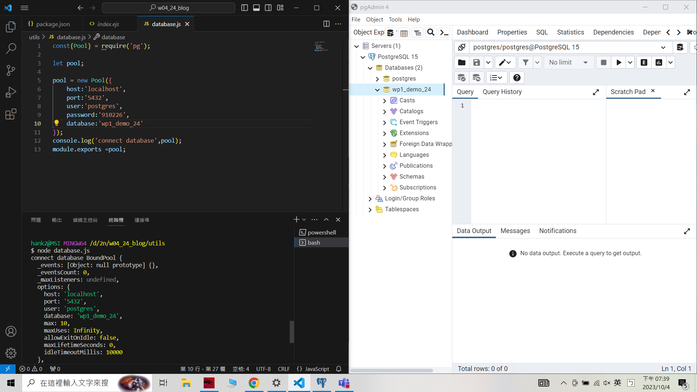
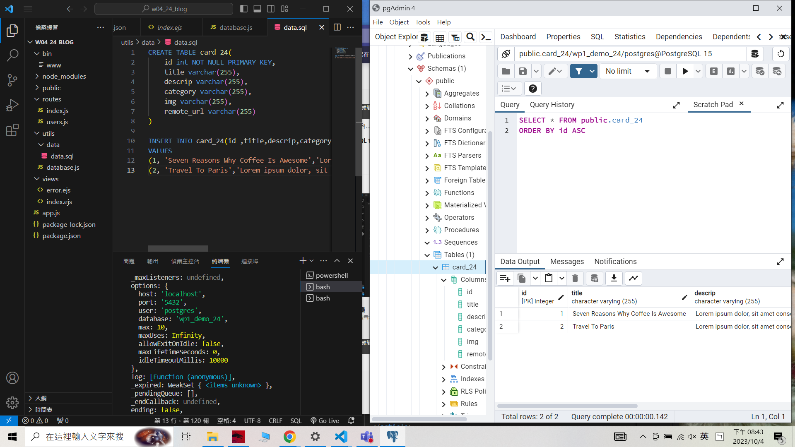
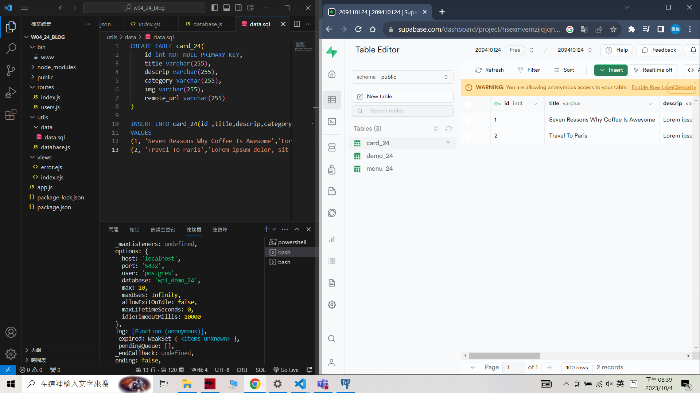

 ### W04-P1: Connect database wp1_demo_24

```
ab4abad unknown Wed Oct 4 19:44:53 2023 +0800   ### W04-P1: Connect database wp1_demo_24
```

 ### W04-P2: Using SQL to create table card_xx, and insert two data
 


 ```
 2c2f3ab unknown Wed Oct 4 20:49:29 2023 +0800   ### W04-P2: Using SQL to create table card_xx, and insert two data
 ```
 
 ### W04-P3: Using Supabase SQL editor to create table card_xx, and insert two data
 



 ```
 25d5fcf unknown Wed Oct 4 20:51:37 2023 +0800   W04-P3: Using Supabase SQL editor to create table card_xx, and insert two data
 ```