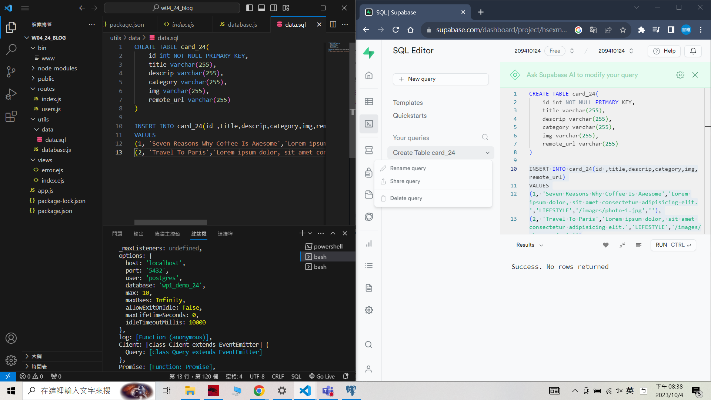
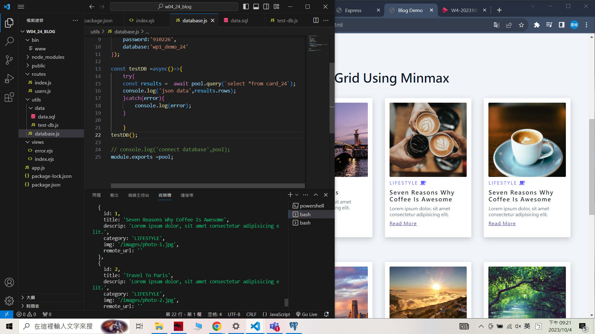
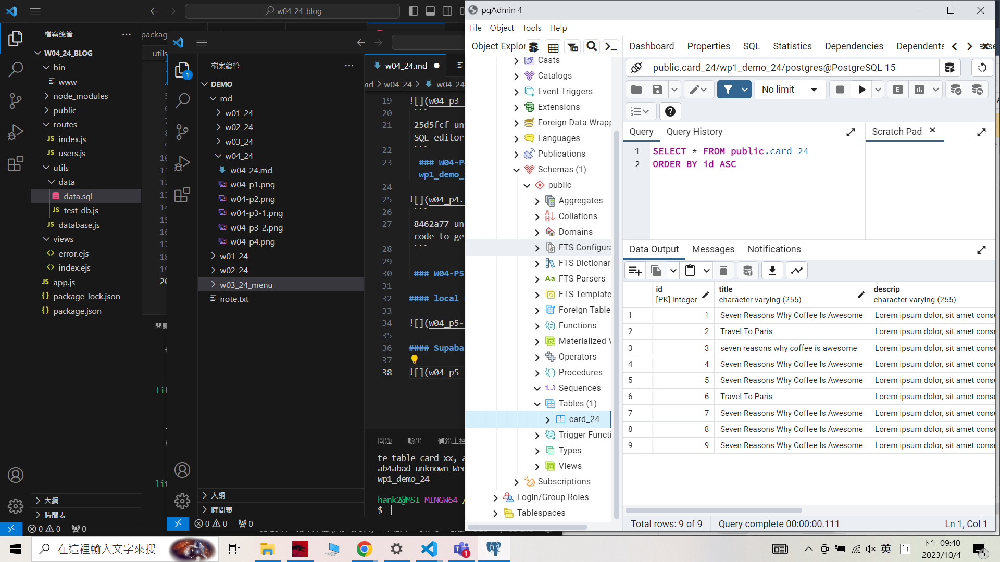
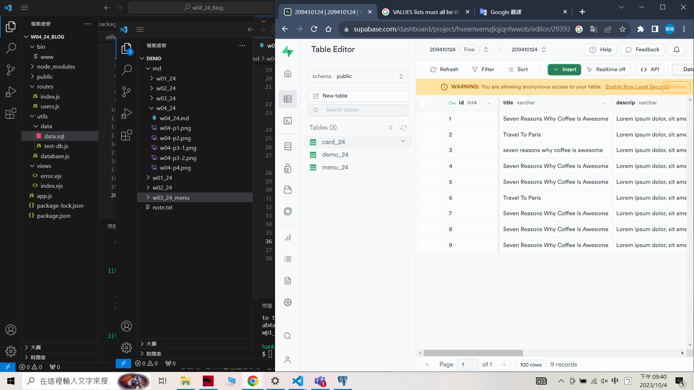
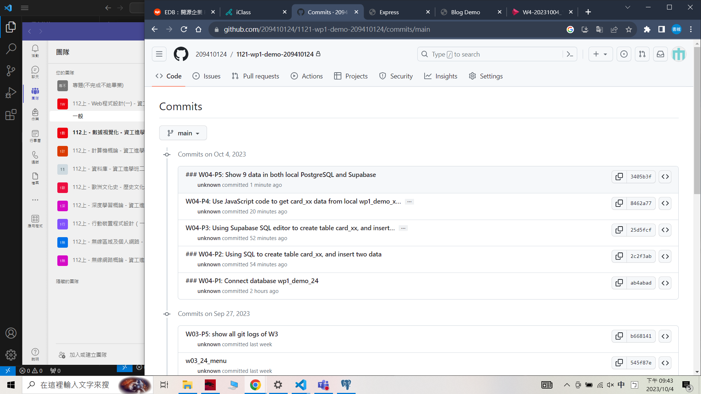

 ### W04-P1: Connect database wp1_demo_24

```
ab4abad unknown Wed Oct 4 19:44:53 2023 +0800   ### W04-P1: Connect database wp1_demo_24
```

 ### W04-P2: Using SQL to create table card_xx, and insert two data
 


 ```
 2c2f3ab unknown Wed Oct 4 20:49:29 2023 +0800   ### W04-P2: Using SQL to create table card_xx, and insert two data
 ```
 
 ### W04-P3: Using Supabase SQL editor to create table card_xx, and insert two data
 



 ```
 25d5fcf unknown Wed Oct 4 20:51:37 2023 +0800   W04-P3: Using Supabase SQL editor to create table card_xx, and insert two data
 ```
  ### W04-P4: Use JavaScript code to get card_xx data from local wp1_demo_xx database
 

 ```
 8462a77 unknown Wed Oct 4 21:22:51 2023 +0800   W04-P4: Use JavaScript code to get card_xx data from local wp1_demo_xx databas
 ```

 ### W04-P5: Show 9 data in both local PostgreSQL and Supabase
 
#### local PostgreSQL
 

 
#### Supabase
 

```
3405b3f unknown Wed Oct 4 21:42:04 2023 +0800   ### W04-P5: Show 9 data in both local PostgreSQL and Supabase
```
### W04-P6: W4 all logs
 



### git log

```
$ git log --pretty=format:"%h%x09%an%x09%ad%x09%s" --after="2023-10-03"
3405b3f unknown Wed Oct 4 21:42:04 2023 +0800   ### W04-P5: Show 9 data in both local PostgreSQL and Supabase
8462a77 unknown Wed Oct 4 21:22:51 2023 +0800   W04-P4: Use JavaScript code to get card_xx data from local wp1_demo_xx databas
25d5fcf unknown Wed Oct 4 20:51:37 2023 +0800   W04-P3: Using Supabase SQL editor to create table card_xx, and insert two data
2c2f3ab unknown Wed Oct 4 20:49:29 2023 +0800   ### W04-P2: Using SQL to create table card_xx, and insert two data
ab4abad unknown Wed Oct 4 19:44:53 2023 +0800   ### W04-P1: Connect database wp1_demo_24