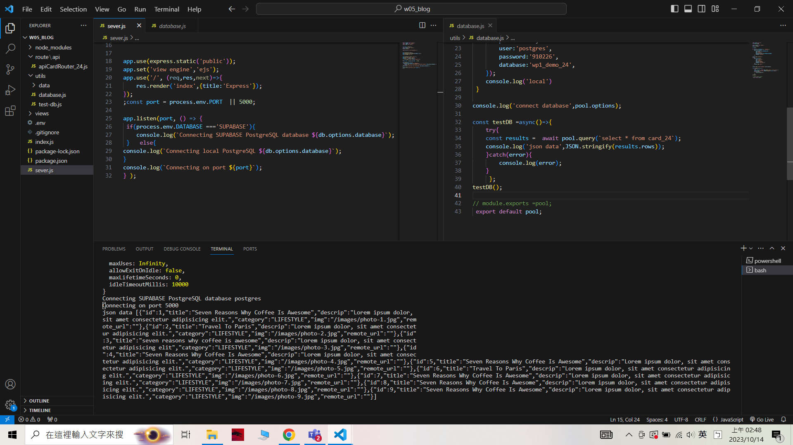
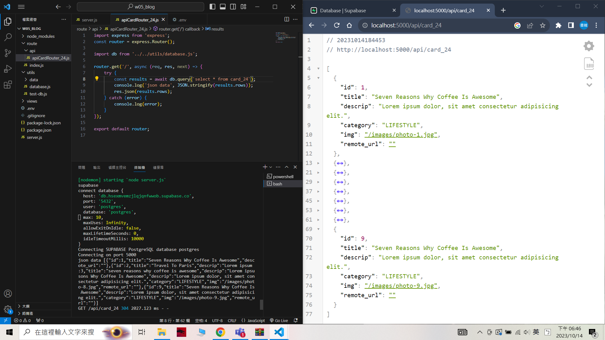

### W05-P1: Demo how to use environment variable DATABASE
 
 

git log --pretty=format:"%h%x09%an%x09%ad%x09%s" --after="2023-010-13"

```
5f47a12 unknown Wed Oct 11 19:57:04 2023 +0800  W05-P1: Demo how to use environment variable DATABASE
```

### W05-P2: Using pgAdmin 4 to get table card_24 from Supabase
 


```
62ef340 unknown Wed Oct 11 20:50:38 2023 +0800  W05-P2: Using pgAdmin 4 to get table card_24 from Supabase
```


### W05-P3: Using database.js to connect to Supabase and show card_24 data
 



```
2ad7e37 unknown Sat Oct 14 02:52:54 2023 +0800  W05-P3: Using database.js to connect to Supabase and show card_24 data
```


### W04-P4: For route /api/card_24, get Json data from Supabase
 

 ```
 70c045a unknown Sat Oct 14 18:47:51 2023 +0800  W04-P4: For route /api/card_24, get Json data from Supabase
 ```

 ### W05-P5: W5 all logs

 ```
 5f47a12 unknown Wed Oct 11 19:57:04 2023 +0800  W05-P1: Demo how to use environment variable DATABASE
 

 62ef340 unknown Wed Oct 11 20:50:38 2023 +0800  W05-P2: Using pgAdmin 4 to get table card_24 from Supabase


 2ad7e37 unknown Sat Oct 14 02:52:54 2023 +0800  W05-P3: Using database.js to connect to Supabase and show card_24 data

  70c045a unknown Sat Oct 14 18:47:51 2023 +0800  W04-P4: For route /api/card_24, get Json data from Supabase
 ```