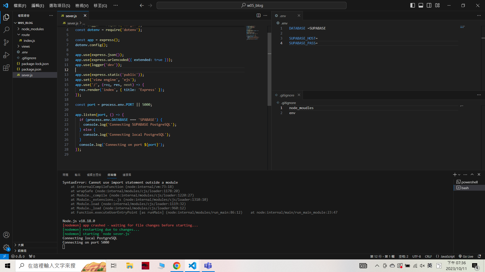
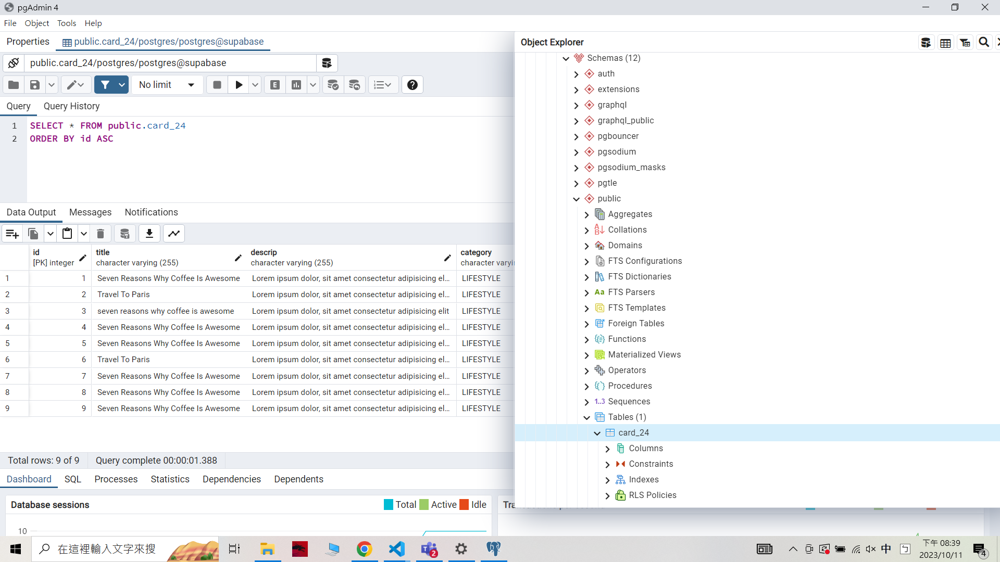

### W05-P1: Demo how to use environment variable DATABASE
 
 

git log --pretty=format:"%h%x09%an%x09%ad%x09%s" --after="2023-010-10"

```
5f47a12 unknown Wed Oct 11 19:57:04 2023 +0800  W05-P1: Demo how to use environment variable DATABASE
```

### W05-P2: Using pgAdmin 4 to get table card_xx from Supabase
 
