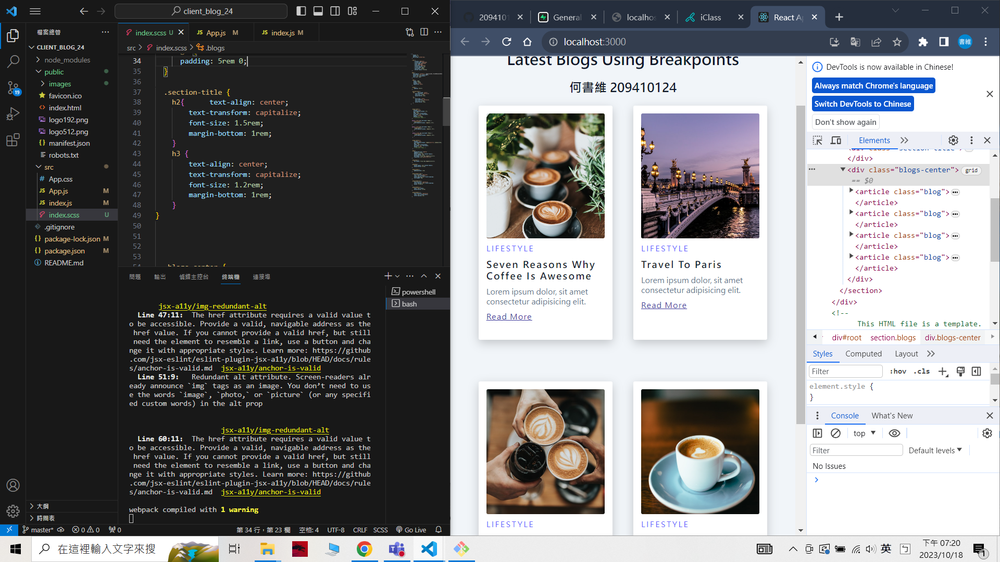
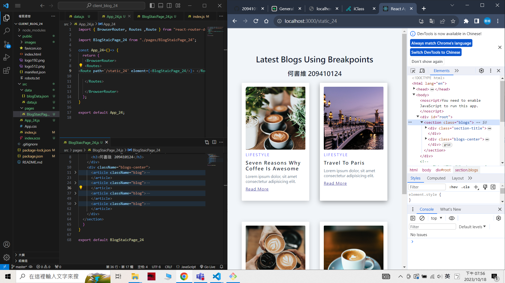
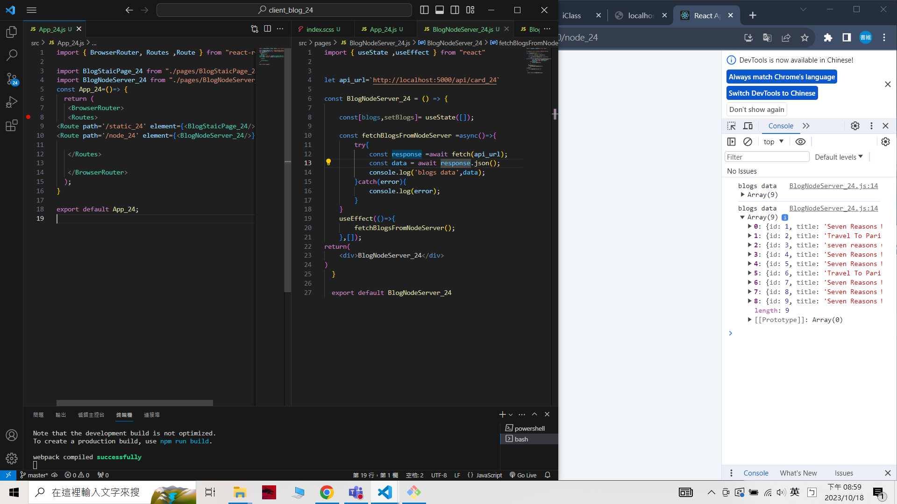

### W06-P1: Run the server in W5 using /api/card_24
 


git log --pretty=format:"%h%x09%an%x09%ad%x09%s" --after="2023-10-17"

```
7de4c44 unknown Wed Oct 18 18:37:30 2023 +0800  W06-P1: Run the server in W5 using /api/card_24
```
 ### W06-P2: blog html theme convert to React using scss
 



```
4179532 unknown Wed Oct 18 19:23:24 2023 +0800   W06-P2: blog html theme convert to React using scss
```

### W06-P3: use route /static_xx to show <BlogStaticPage_24 />
 


```
dc264eb unknown Wed Oct 18 20:03:08 2023 +0800  W06-P3: use route /static_xx to show <BlogStaticPage_24 />
```

 ### W06-P4: Fetch data from node server via route /node_24, show data in console.log
 
