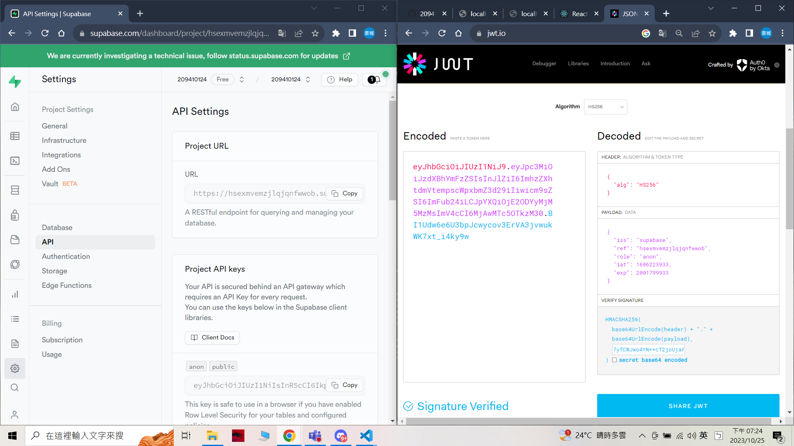
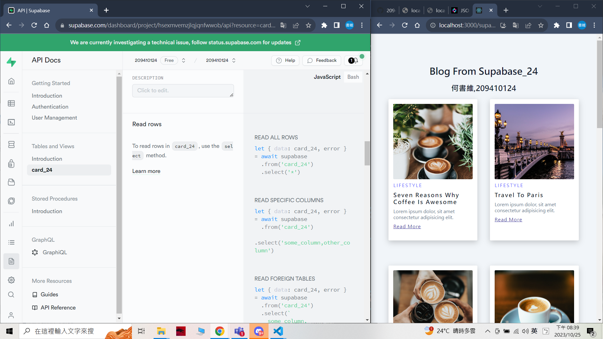

### W07-P1: jwt introduction using anon key in Supabase
 

 

 git log --pretty=format:"%h%x09%an%x09%ad%x09%s" --after="2023-10-24"


 ```
 2ef274d unknown Wed Oct 25 19:28:14 2023 +0800  W07-P1: jwt introduction using anon key in Supabase
 ```

  ### W07-P2: Fetch blog data from Supabase
 

 

 

 
 ```
 2ef274d unknown Wed Oct 25 19:28:14 2023 +0800  W07-P1: jwt introduction using anon key in Supabase
 ```


 ### W07-P3: Deploy to vercel, using /supa_24 to get blogs from Supabase
 
[Vercel URL](https://1121-2-n-client-blog-24.vercel.app/supa_24)
 

 


```
41eb700 unknown Wed Oct 25 21:21:09 2023 +0800  W07-P3: Deploy to vercel, using /supa_24 to get blogs from Supabase

```

 ### W07-P4: Implement BlogLocalJson_24.js to fetch blogs from json data
 

 

 ```
 cefb07a unknown Wed Oct 25 22:01:16 2023 +0800  W07-P4: Implement BlogLocalJson_24.js to fetch blogs from json data
 ```

### W07-P5: W7 all logs
 


