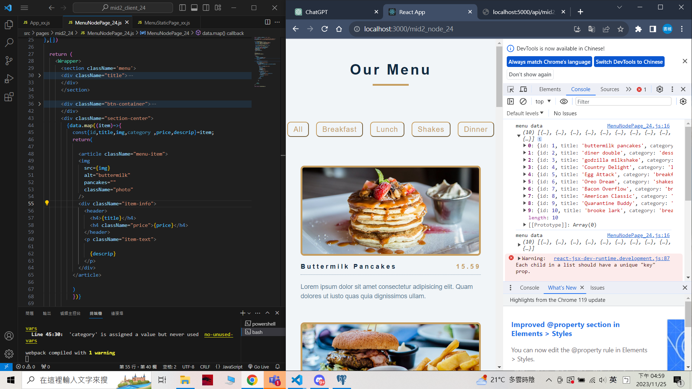
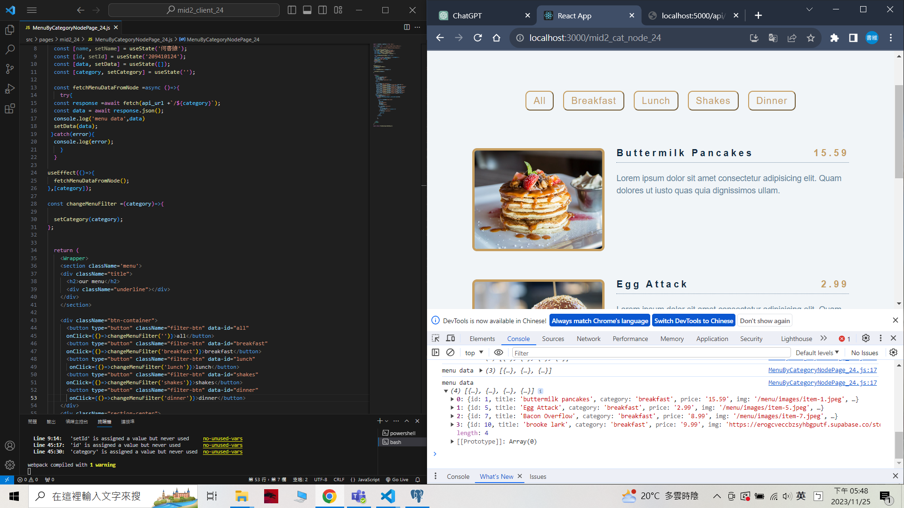
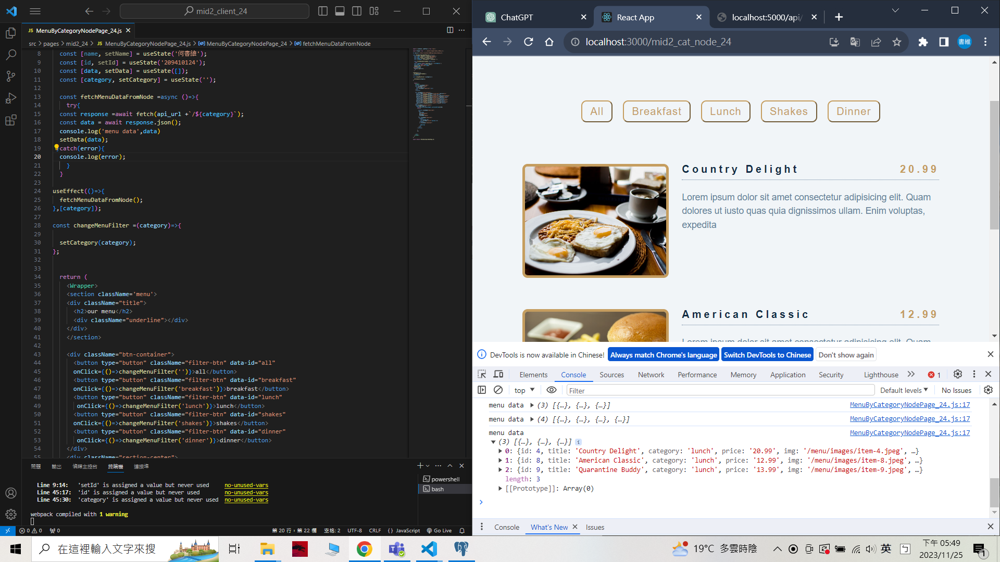
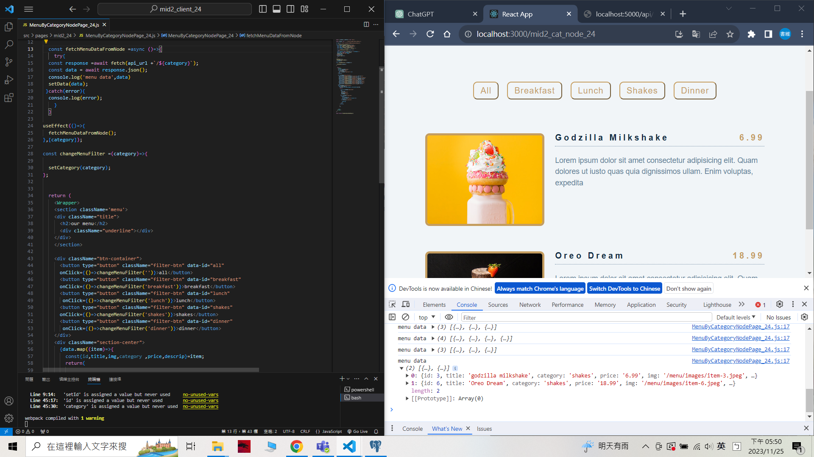
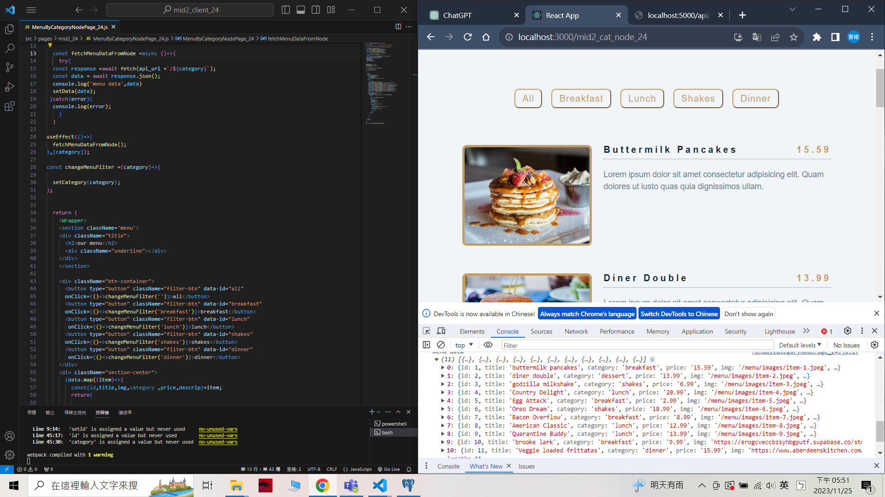
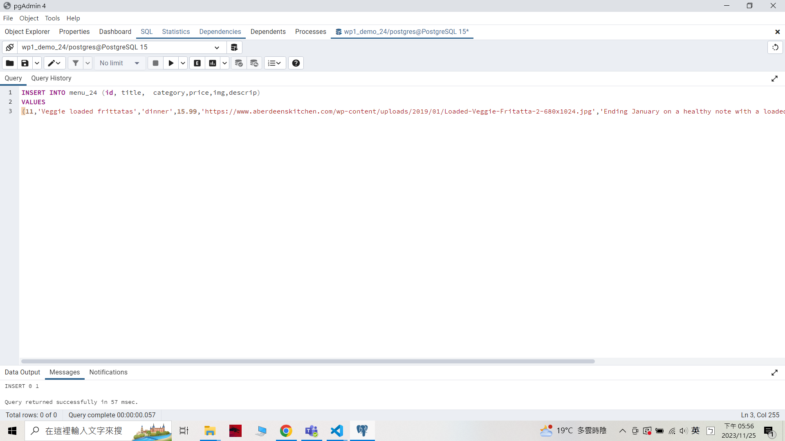
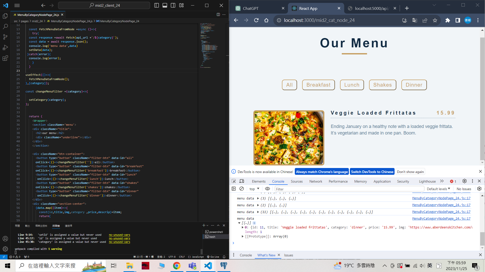
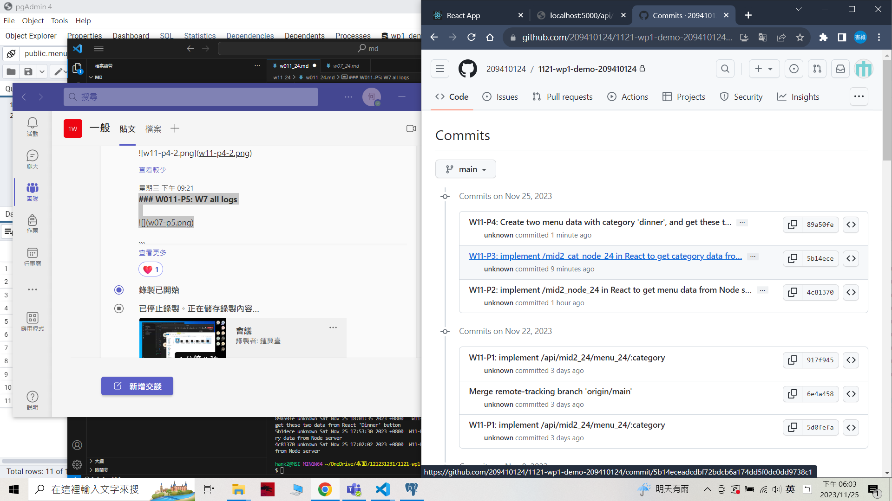

### W11-P1: implement /api/mid2_24/menu_24/:category
 

 git log --pretty=format:"%h%x09%an%x09%ad%x09%s" --after="2023-11-24"

 ```
 5d0fefa unknown Wed Nov 22 20:13:56 2023 +0800  W11-P1: implement /api/mid2_24/menu_24/:category
 ```

 ### W11-P2: implement /mid2_node_24 in React to get menu data from Node server
 

 
 ```
 4c81370 unknown Sat Nov 25 17:02:02 2023 +0800  W11-P2: implement /mid2_node_24 in React to get menu data from Node server
 ```

 ### W11-P3: implement /mid2_cat_node_24 in React to get category data from Node server
 

 

 

 

 

 ```
 5b14ece unknown Sat Nov 25 17:53:30 2023 +0800  W11-P3: implement /mid2_cat_node_24 in React to get category data from Node server
 ```

 ### W11-P4: Create two menu data with category 'dinner', and get these two data from React 'Dinner' button
 
#### => in pgAdmin, show two newly added data

 
#### => in React, show two newly added data by pressing Dinner button
 


```
89a50fe unknown Sat Nov 25 18:01:35 2023 +0800   W11-P4: Create two menu data with category 'dinner', and 
get these two data from React 'Dinner' button
```

### W011-P5: W7 all logs
 
