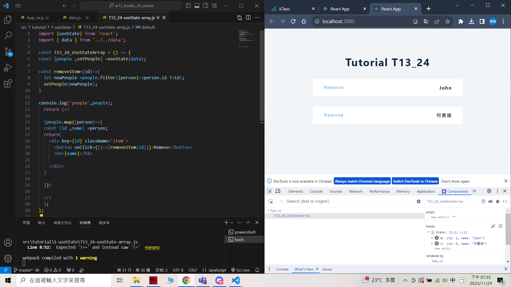
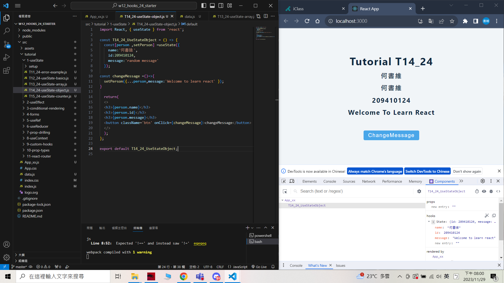
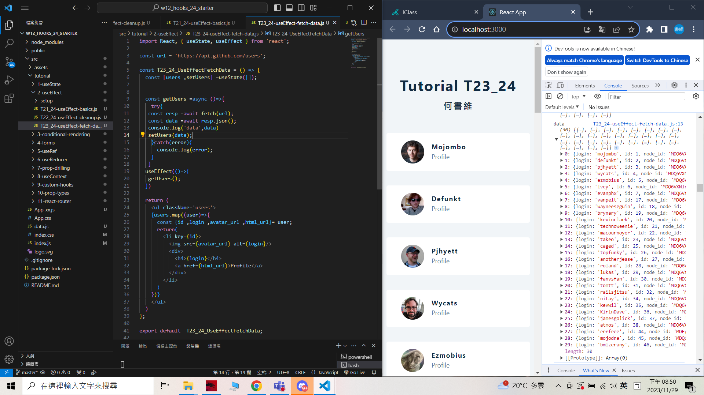

### W12-P1: Do advanced hooks: T11_24 & T12_24

[My Github repo URL](https://github.com/209410124/1121-wp1-demo-209410124)


 


 git log --pretty=format:"%h%x09%an%x09%ad%x09%s" --after="2023-11-28"

```
29baa95 unknown Wed Nov 29 19:10:44 2023 +0800  W12-P1: Do advanced hooks: T11_24 & T12_24
```

### W12-P2: Do T13_24 using array
 


```
4265bbc unknown Wed Nov 29 19:36:40 2023 +0800  W12-P2: Do T13_24 using array
```

 ### W12-P3: Do T14_24 using object
 


```
89c3190 unknown Wed Nov 29 20:02:07 2023 +0800  W12-P3: Do T14_24 using object
```

### W12-P4: Do T23_24, fetch Github users using useEffect
 
