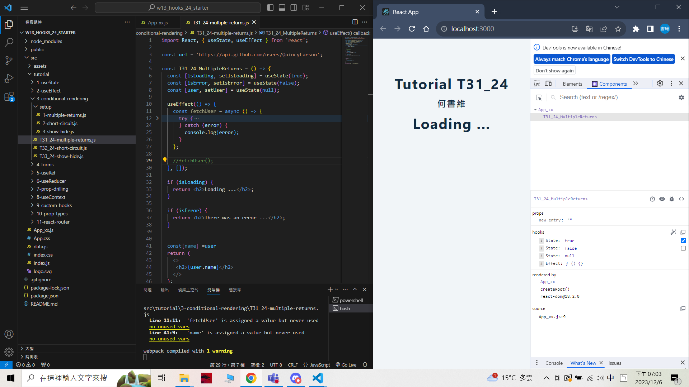
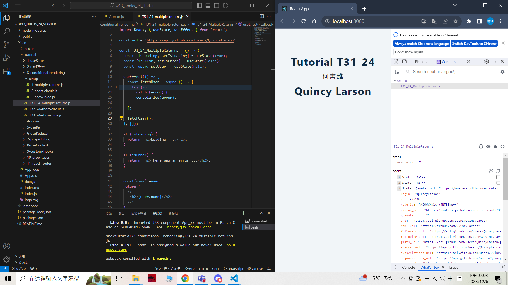
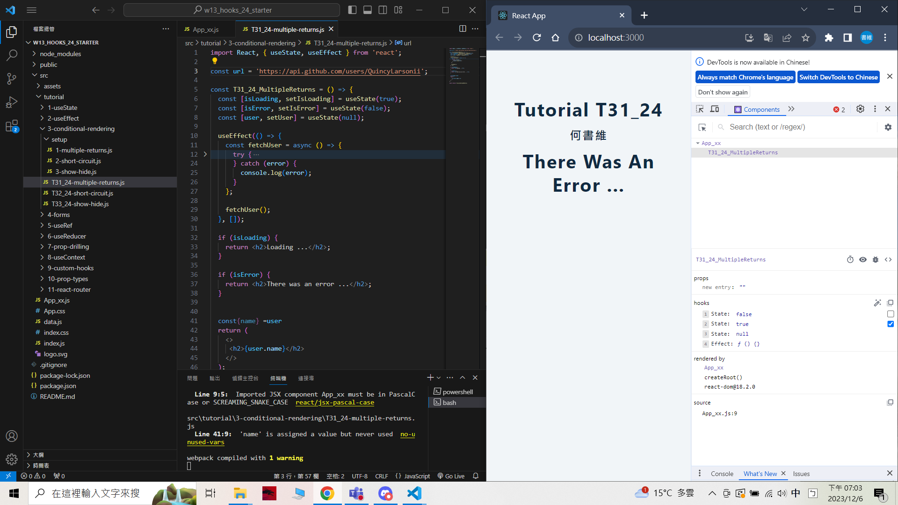
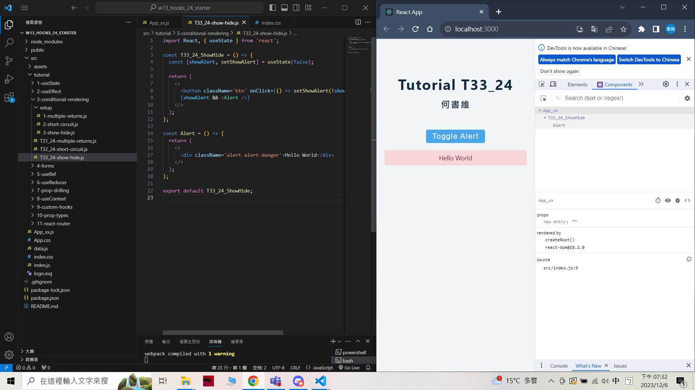
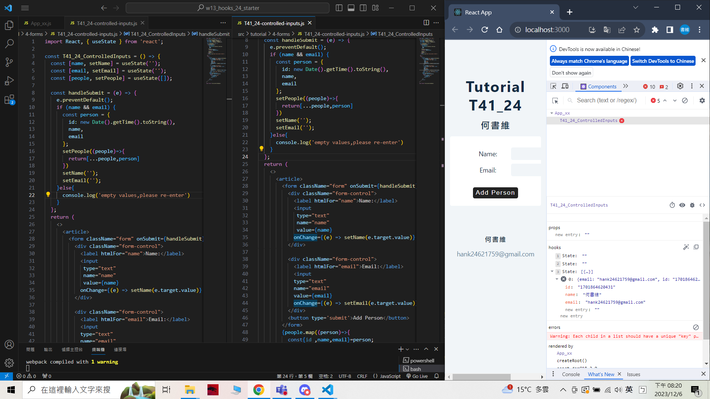
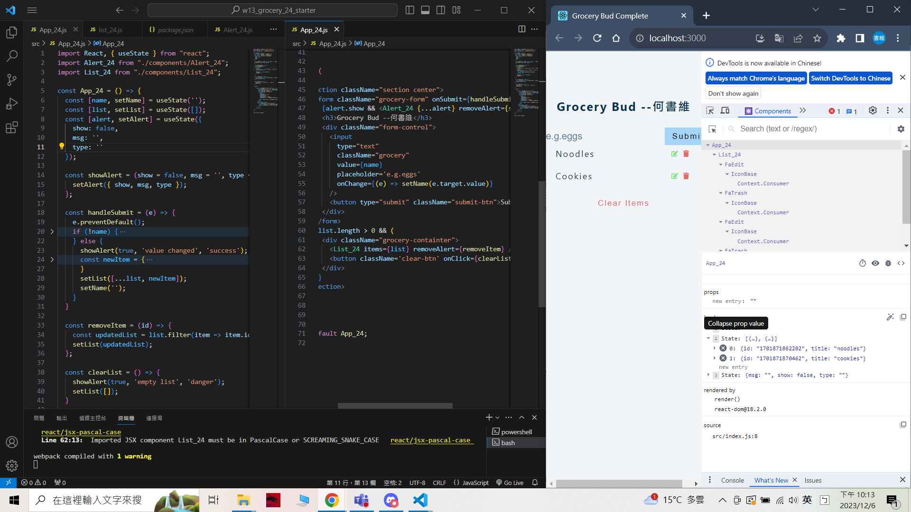
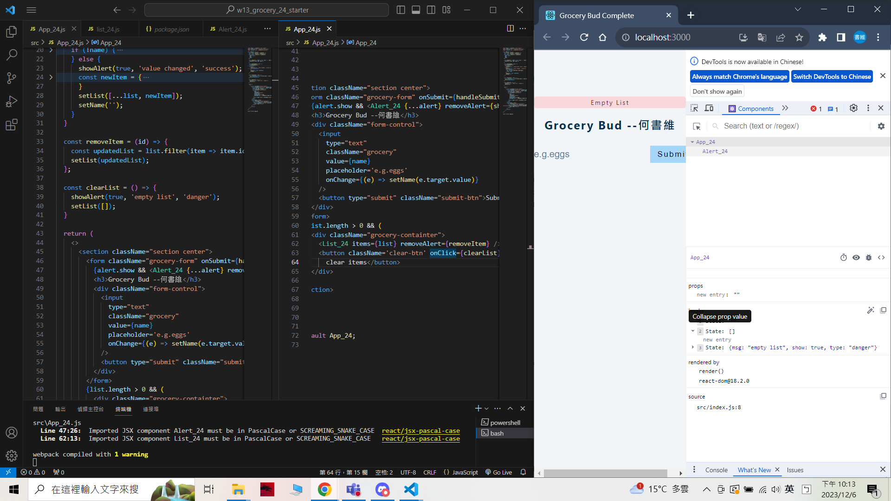
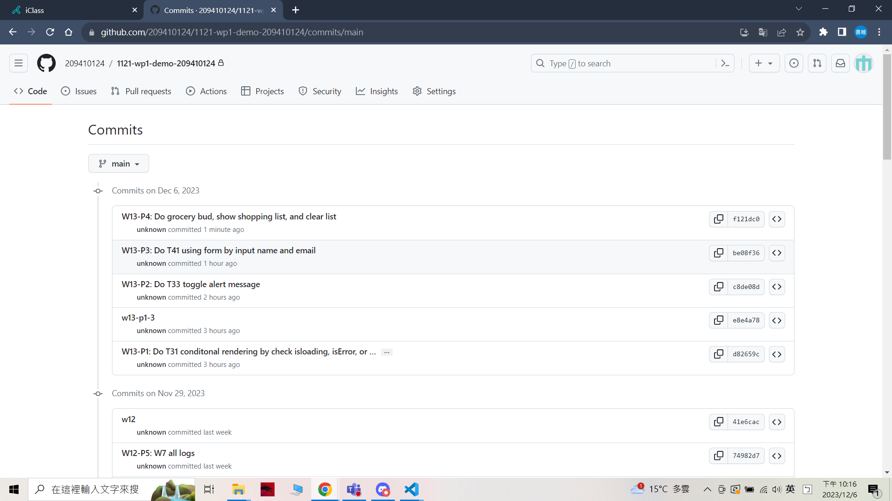

### W13-P1: Do T31 conditonal rendering by check isloading, isError, or fetch user data correctly

 [My Github repo URL](https://github.com/209410124/1121-wp1-demo-209410124)

 git log --pretty=format:"%h%x09%an%x09%ad%x09%s" --after="2023-12-05"


 




```
d82659c unknown Wed Dec 6 19:07:21 2023 +0800    W13-P1: Do T31 conditonal rendering by check isloading, isError, or fetch user data correctly
```

### W13-P2: Do T33 toggle alert message
 


```
c8de08d unknown Wed Dec 6 19:37:43 2023 +0800   W13-P2: Do T33 toggle alert message
```

### W13-P3: Do T41 using form by input name and email
 


```
be08f36 unknown Wed Dec 6 20:22:07 2023 +0800   W13-P3: Do T41 using form by input name and email
```

### W13-P4: Do grocery bud, show shopping list, and clear list
 

 


```
f121dc0 unknown Wed Dec 6 22:15:48 2023 +0800   W13-P4: Do grocery bud, show shopping list, and clear list
```


### W13-P5: W13 git logs
 
