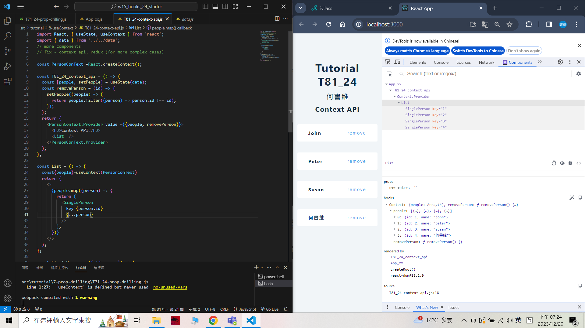
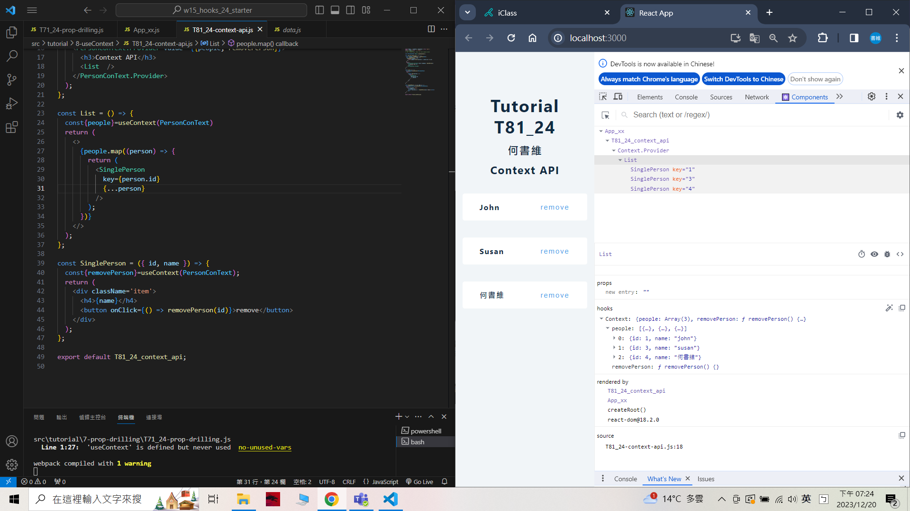
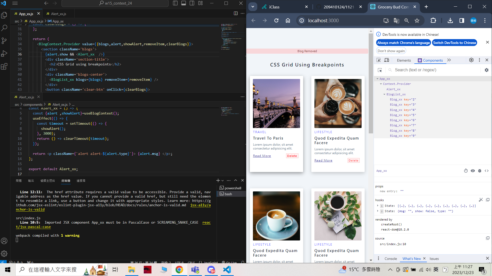
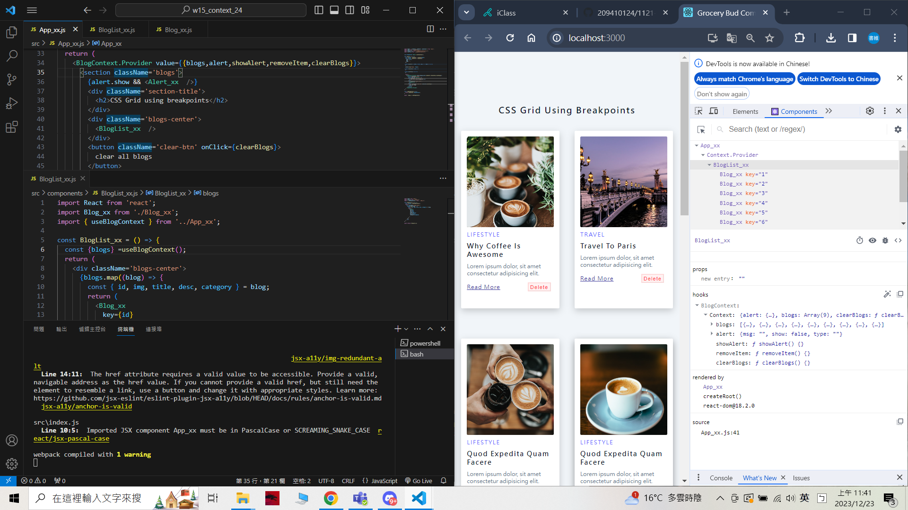
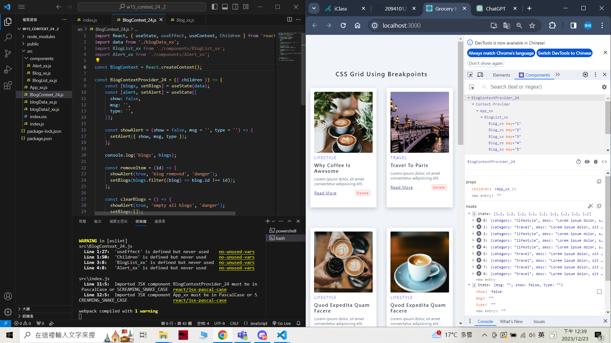
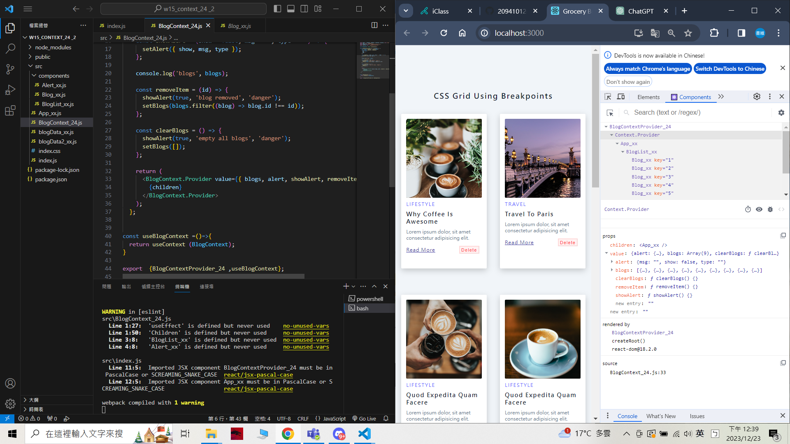
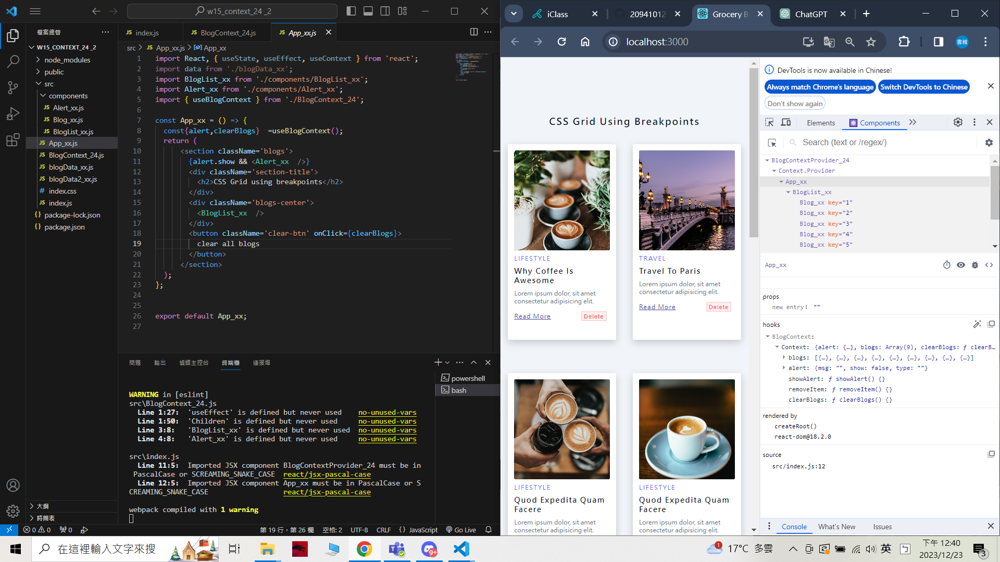
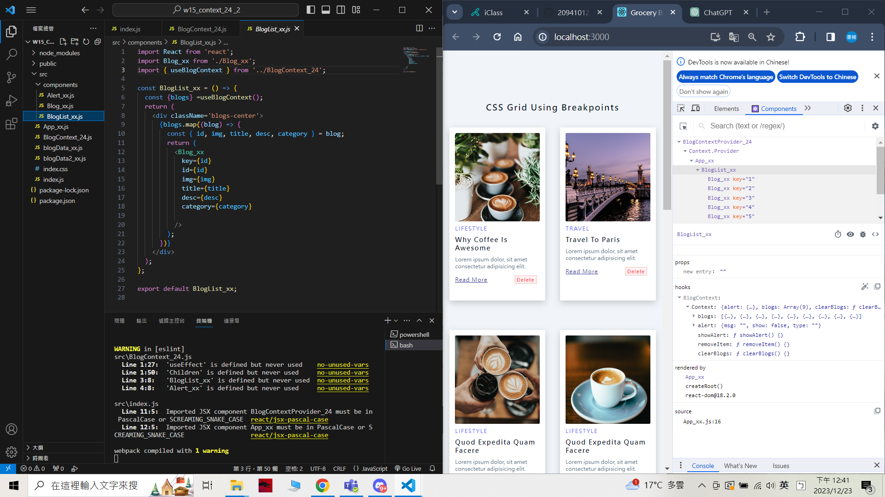
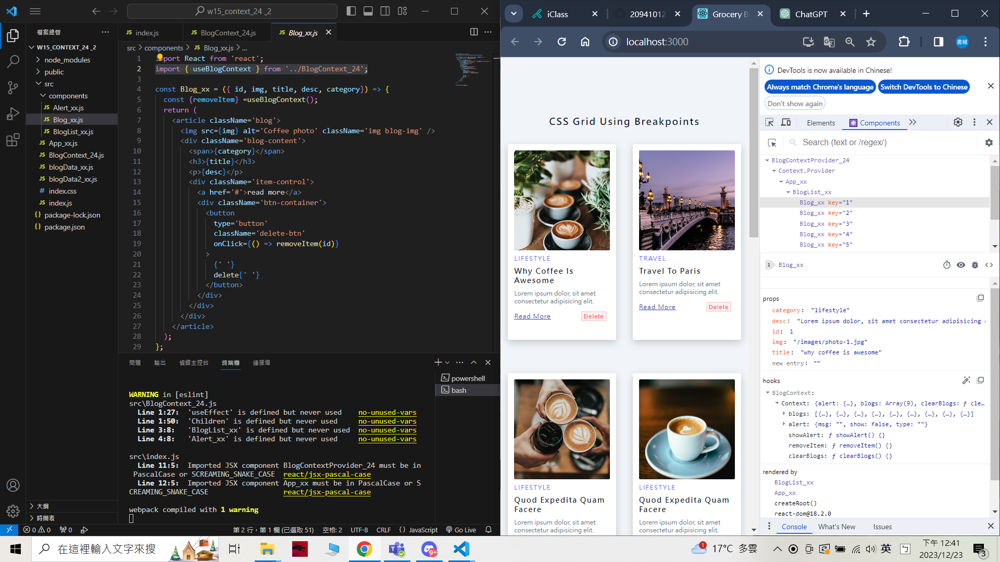
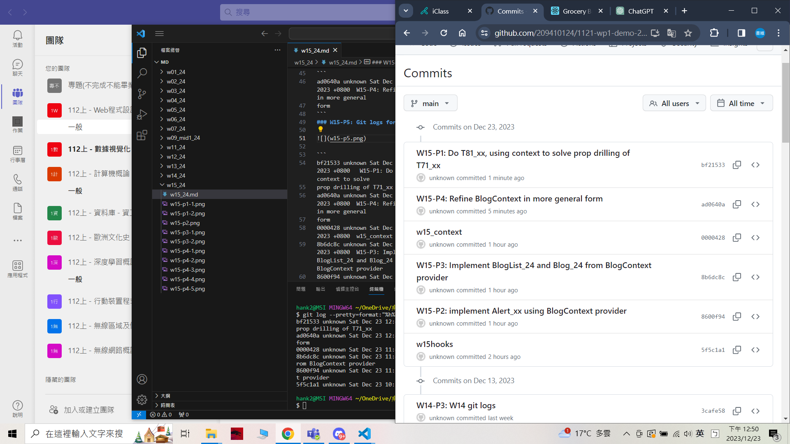

[My Github repo URL](https://github.com/209410124/1121-wp1-demo-209410124)


### W15-P1: Do T81_xx, using context to solve prop drilling of T71_xx
 

 

```
bf21533 unknown Sat Dec 23 12:48:58 2023 +0800   W15-P1: Do T81_xx, using context to solve 
prop drilling of T71_xx
```
git log --pretty=format:"%h%x09%an%x09%ad%x09%s" --after="2023-12-22"

### W15-P2: implement Alert_xx using BlogContext provider
 

 
 ```
 8600f94 unknown Sat Dec 23 11:30:29 2023 +0800  W15-P2: implement Alert_xx using BlogContext provider
 ```

 ### W15-P3: Implement BlogList_24 and Blog_24 from BlogContext provider
 

 

```
8b6dc8c unknown Sat Dec 23 11:44:54 2023 +0800  W15-P3: Implement BlogList_24 and Blog_24 from BlogContext provider
```

### W15-P4: Refine BlogContext in more general form
 

 

 

 

 


```
ad0640a unknown Sat Dec 23 12:44:40 2023 +0800  W15-P4: Refine BlogContext in more general 
form
```
### W15-P5: Git logs for W15
 


```
bf21533 unknown Sat Dec 23 12:48:58 2023 +0800   W15-P1: Do T81_xx, using context to solve 
prop drilling of T71_xx
ad0640a unknown Sat Dec 23 12:44:40 2023 +0800  W15-P4: Refine BlogContext in more general 
form
0000428 unknown Sat Dec 23 11:49:30 2023 +0800  w15_context
8b6dc8c unknown Sat Dec 23 11:44:54 2023 +0800  W15-P3: Implement BlogList_24 and Blog_24 from BlogContext provider
8600f94 unknown Sat Dec 23 11:30:29 2023 +0800  W15-P2: implement Alert_xx using BlogContext provider
```